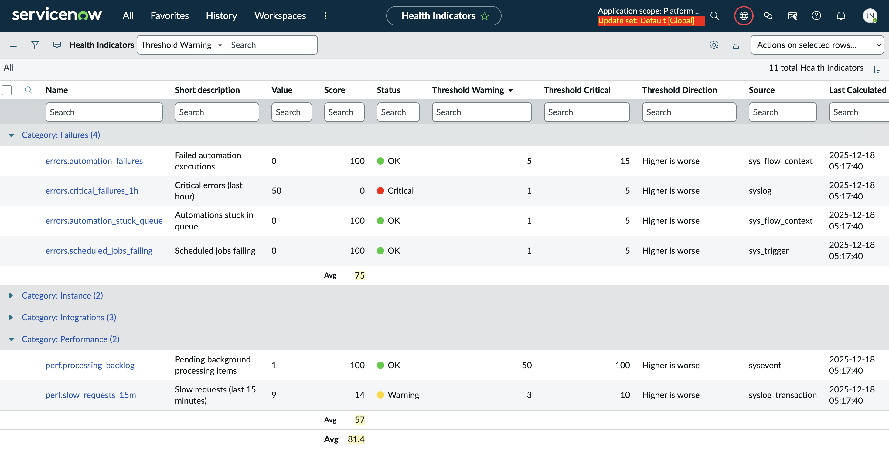
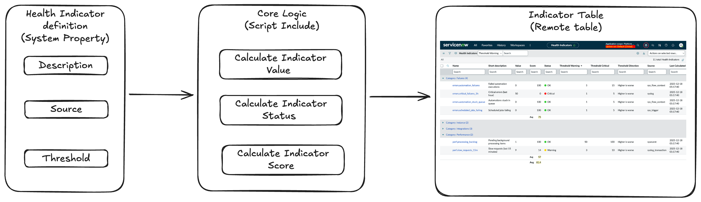

# ServiceNow Platform Health – Core

A lightweight, config-driven **ServiceNow platform health indicator engine** built using **Remote Tables**.

This repository contains the **core logic** used to compute and expose platform health indicators.  
It is UI-agnostic and can be consumed by dashboards, reports, UI Builder, or mobile applications.

---

## 🎯 Purpose & Scope

The purpose of this project is **not** to provide full or advanced platform monitoring.

It is **not a replacement** for:
- ServiceNow Instance Observer
- Deep performance diagnostics tools

### What this project is

This core application provides a **quick, actionable snapshot of the current state of a ServiceNow instance**, helping administrators answer questions such as:

- Is the instance healthy right now?
- Are there ongoing errors or failures?
- Is performance or automation currently degraded?
- Do integrations or MID Servers need attention?

It focuses on **current / recent signals**, not long-term analytics.

---

## ✨ Key Capabilities

- **Declarative indicator definitions**  
  Indicators are defined via a single system property (JSON).

- **On-demand evaluation**  
  Indicators are computed in real time using aggregate queries (`COUNT`, `AVG`, `SUM`, …).

- **Remote Table exposure**  
  No physical data storage, no duplication, no retention strategy required.

- **Health status & scoring**  
  Each indicator exposes:
  - raw value
  - status (`OK`, `Warning`, `Critical`)
  - health score (0–100), based on distance from thresholds

- **UI-agnostic design**  
  Can be consumed by:
  - list views
  - dashboards
  - reports
  - mobile apps
  - UI Builder pages

---

## 🏗️ Architecture Overview

Each indicator definition includes:
- source table
- aggregation type
- optional encoded query
- thresholds and scoring rules

No indicator data is persisted.

---

## 🏛️ Key Architectural Choices

### Indicator definitions in a system property

Indicators are defined in a **system property** rather than a dedicated configuration table.

**Why:**
- Table creation is often restricted or not free in ServiceNow contracts
- The number of indicators is intentionally limited
- Indicators are platform configuration, not business data
- Configuration changes are infrequent and admin-driven

This choice:
- avoids governance and licensing constraints
- reduces setup overhead
- enables fast iteration

The engine is designed so this can **evolve later** to a dedicated table if needed, without rewriting core logic.

### Remote Table instead of a standard table

Indicators are exposed via a **Remote Table**, not a standard persisted table.

**Why:**
- Remote Tables not backed by external systems are not subject to licensing constraints
- Indicator values already exist somewhere in the platform
- Persisting them would introduce duplication and staleness

This approach ensures:
- always up-to-date values
- zero storage overhead
- minimal operational footprint

The Remote Table acts as a **dynamic projection** of platform health.

## 🚀 Installation (High-Level)

This project can be installed using **ServiceNow Source Control integration with GitHub**.

1. Clone the repository https://github.com/j0hn2608/servicenow-platform-health-core  

2. Connect your ServiceNow instance to GitHub  

3. Import the application from GitHub. Use **System Applications → Studio → Import App**

You can use this procedure as guidance for step 2 & 3: https://www.servicenow.com/community/developer-advocate-blog/source-control-in-servicenow-studio-complete-walkthrough/ba-p/3356303

---

## 🔗 Related Projects

This repository provides the **core indicator engine**.

For a ready-to-use **mobile admin experience**, see:

➡️ **ServiceNow Platform Health – Mobile**  
https://github.com/j0hn2608/servicenow-platform-health-mobile

---

## 🤝 Support & Services

This project is open-source.

Professional services **may be offered separately**, including:
- implementation assistance
- custom indicators
- performance tuning
- enterprise hardening
- training and enablement

---

## 🙌 Contributions

Contributions are welcome.

By submitting a pull request, you agree that your contribution will be licensed under the same license as this project.

---

## 📜 License

This project is licensed under the **Apache License 2.0**.

See the `LICENSE` file for details.

---

## ⚠️ Disclaimer

This project is **not affiliated with or endorsed by ServiceNow, Inc.**  
ServiceNow is a registered trademark of ServiceNow, Inc.
